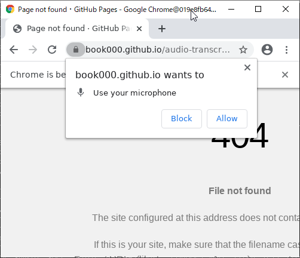

# audio-transcriber-docker

[Click here for English README](README.md)

動画・音声ファイルの音声を`SpeechRecognition`を使って自動的に書き起こす。

## 警告・免責事項

**このプロジェクトを使用したことによって引き起こされた問題に関して開発者は一切の責任を負いません。**

というか、それなりに真面目なことに使うのであれば[Google Cloud PlatformのSpeech-to-Text](https://cloud.google.com/speech-to-text)とかを使いましょう。

一切のサポートはしません。

## インストール

### 1. Git Clone

`git clone https://github.com/book000/audio-transcriber-docker.git`

### 2. `start-mount.bat`または`start-mount.sh`を実行 (初めての場合)

Windowsなら`start-mount.bat`、Linuxなら`start-mount.sh`を実行する。  
このプログラム達は`user-dir`フォルダをマウントする。

出てくる質問は`DISPLAY`と`HOST_USER_DIR`(Windowsのみ)だけ注意すればそれ以外はそのままEnterでも良い

### 3. マイクの使用許可

初期設定として、マイクの使用許可と使用するマイクの設定が必要。最初以外でも音声が正常に認識されないなどあるのであればこの作業をもう一度実行する必要がある。

#### 3-1. `Allow`を押して許可

#### 3-2. ビデオマークを押し、`Microphone`欄を`Virtual Source Virtual Mic on Monitor of Virtual_Microphone_Output`に変更

### 4. 閉じる

`Ctrl+C`をターミナルで押し、処理を中断する。必要であれば`docker stop audio-transcriber`, `docker rm audio-transcriber`を実行。

## 使い方

インストールを終えたあと、普通に使う場合

### 1. `start.bat`または`start.sh`を実行

Windowsなら`start.bat`、Linuxなら`start.sh`を実行する。

出てくる質問は以下。

- `Movie or Audio File Path`
  - 読み込むファイル(動画・音声ファイル)を指定。`mp4`, `m4v`, `webm`など`ffmpeg`で変換できるものならなんでも良い
- `DockerName`
  - Dockerのコンテナ名を指定。既存のコンテナ名を指定した場合確認せず`stop`と`rm`をするので注意。
  - 指定せずEnterした場合`audio-transcriber`を使用。
- `DISPLAY`
  - DISPLAY(映像出力先)の指定。Docker内には基本的に映像出力先がないので、ホストのDISPLAYを指定(`192.168.0.100:0`など)

`TeraTerm`や`Mobaxterm`でX11の受け先を作っておくこと。

### 2. 処理

Chromeが起動してごにょごにょ動く。

### 3. `audio-text.txt`を見る

基本的に`audio-text.txt`に書き込まれるので、それ。

## ライセンス / License

このプロジェクトのライセンスは[MIT License](https://github.com/book000/audio-transcriber-docker/blob/master/LICENSE)です。
