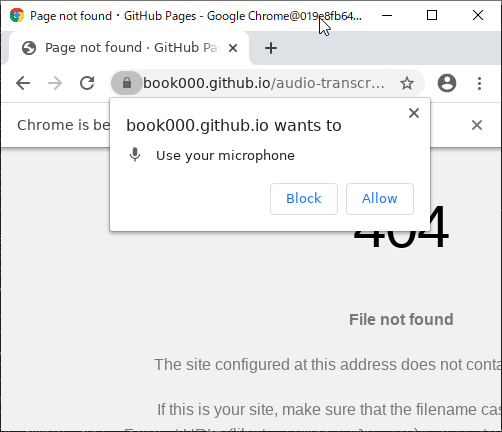
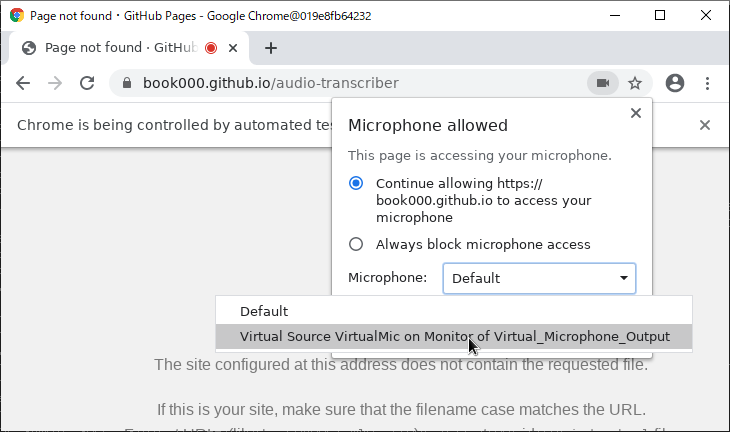

# audio-transcriber-docker

[日本語のREADMEはこちらから](README-ja.md)

Automatically transcribe the audio of video / audio files using `Speech Recognition`.

## Warning / Disclaimer

**The author is not responsible for any problems caused by the user using this project.**

Or rather, if you want to use it seriously, use [Google Cloud Platform Speech-to-Text](https://cloud.google.com/speech-to-text).  
We do not provide any support.

## Installation

### 1. Git Clone

`git clone https://github.com/book000/audio-transcriber-docker.git`

### 2. Run `start-mount.bat` or `start-mount.sh` (First)

Run `start-mount.bat` on Windows, `start-mount.sh` on Linux.  
These programs mount the `user-dir` folder and `output` folder.

If you pay attention only to `DISPLAY`, you can just enter the other questions.

### 3. Permit using microphone

As an initial setting, you need to set the microphone permission and the microphone to be used. If the audio is not recognized correctly the first time, you need to perform this work again.

#### 3-1. Press `Allow` to allow

#### 3-2. Press the video symbol and change the `Microphone` field to `Virtual Source Virtual Mic on Monitor of Virtual_Microphone_Output`

### 4. Close the window

Press `Ctrl+C` at the terminal to abort the process. Run `docker stop audio-transcriber`, `docker rm audio-transcriber` if necessary.

## Usage

After Installation, if you use it normally

### 1. Run `start.bat` or `start.sh`

Run `start.bat` on Windows, `start.sh` on Linux.  
These programs mount the `output` folder.

The questions that come up are below.

- `Movie or Audio File Path`
  - Specify the files to be loaded (video and audio files). `mp4`, `m4v`, `webm` and anything else that can be converted with `ffmpeg`
- `DockerName`
  - Specify the name of the container in Docker. Note that if you specify an existing container name, it will be `stop` and `rm` without checking.
  - Use `audio-transcriber` if you enter without specifying.
- `DISPLAY`
  - Specifies the DISPLAY of the host (e.g., `192.168.0.100:0`) because there is no video output destination in the Docker.

Make a destination for X11 with `TeraTerm` or `Mobaxterm`.

### 2. Processing

After Chrome is launched, it works.

### 3. View the `output/{DateTime}.txt`

It is written to `output/{DateTime}.txt`.

## License

The license for this project is [MIT License](https://github.com/book000/audio-transcriber-docker/blob/master/LICENSE).
